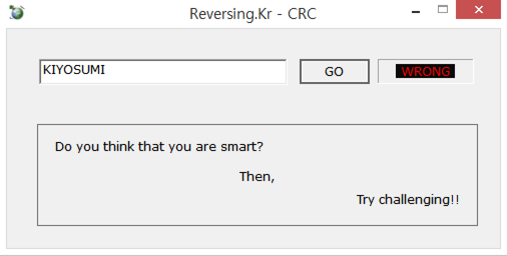
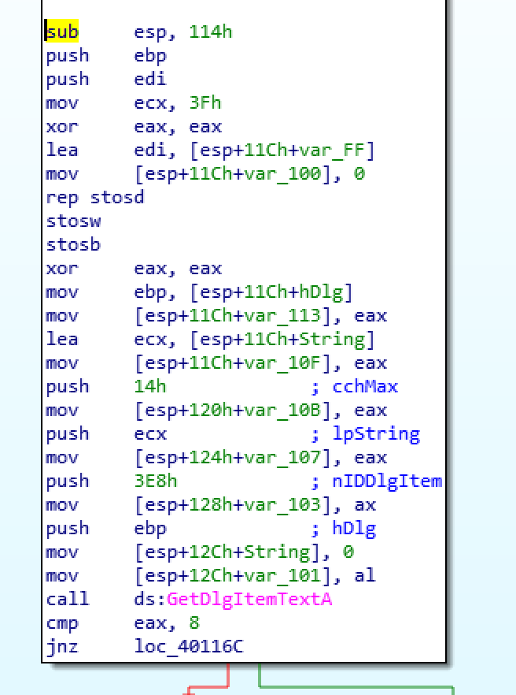
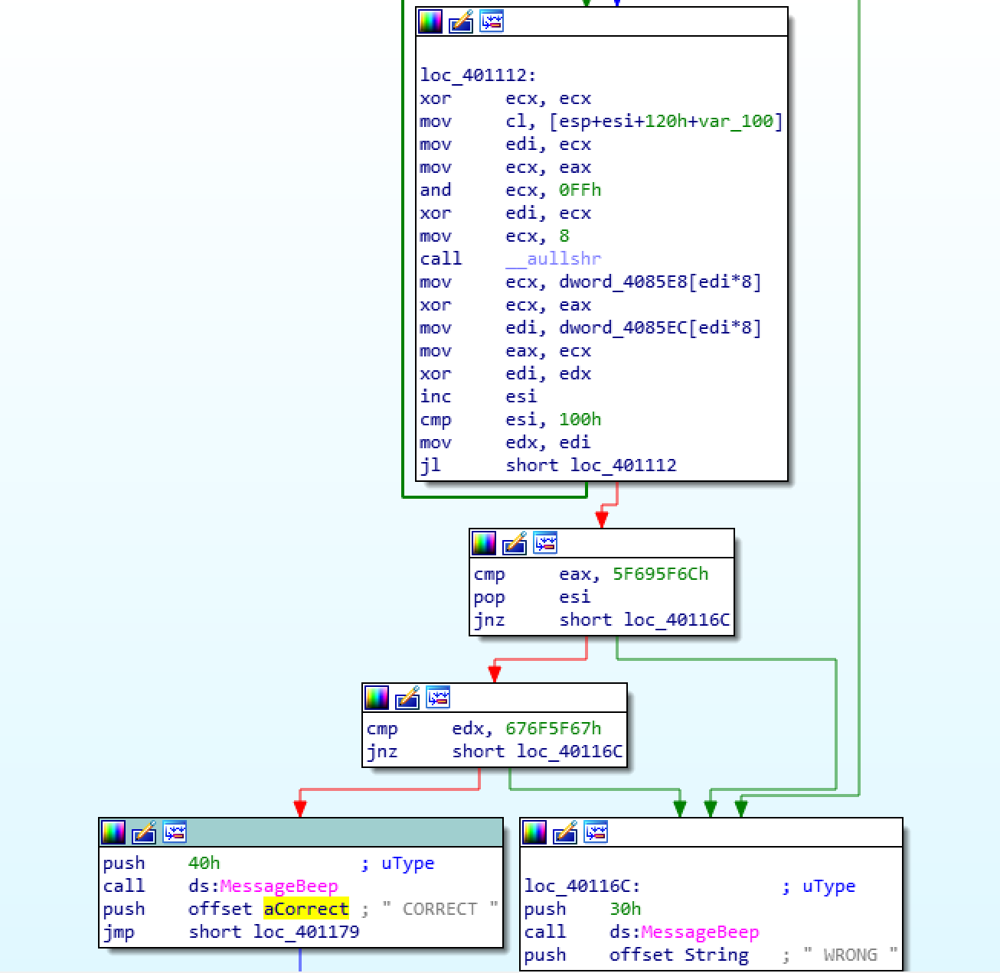
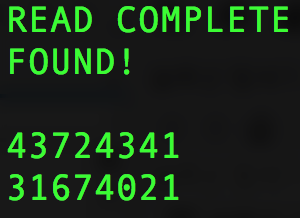
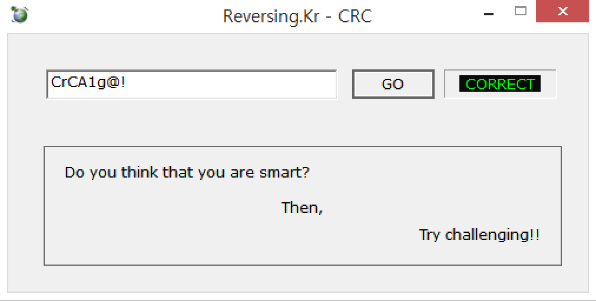

# reversing.kr - CRC1(250)

FILE : x86 EXE

CRC 문제이다. 값을 입력받고 체크하는 프로그램이다.



IDA로 열어보면



문자열의 길이가 8인지 검증한 후에



위와같이 CRC 해시를 만들고 그 값이 0x676F5F675F695F6C인지 체크한다.

루틴 자체는 아래와 같이 단순하다.

```c
l = (crc[k] ^ (u & 0xFF)) & 0xFF;
u = ((unsigned __int64)u >> 8ULL);
u ^= crc2[l];
```

그러나 브루트포싱의 범위가 너무 넓다. 따라서 이를 줄이기 위해 모종의 방법을 써야한다.

내가 선택한 방법은 역연산이다. 문자열을 통해 CRC를 만드는데 문자열이 그대로 있으므로 역연산이 가능하다.(역연산은 직접 구현해 보길 바란다.)


이를 앞 4글자 정연산, 뒤 4글자 정연산으로 중간 hash를 만들어 비교를 하면 맞는 답이 몇개 나올 것이다. 중간점이 제일 경우의 수가 작다는 것은 수학적 상식. 해시테이블을 두개 만들고 비교하자.

### Solution Code

```python
import sys

def Usage():
	print "Usage: list_compare.exe [src.txt] [compare.txt]"

def main():
	if len(sys.argv) != 3:
		Usage()
		sys.exit()

	srcTxt = sys.argv[1]
	cmpTxt = sys.argv[2]

	f1 = open(srcTxt, 'r')
	f2 = open(cmpTxt, 'r')

	srcData = f1.readlines()
	cmpData = f2.readlines()

	cnt = 0
	print "READ COMPLETE"

	for srcline in srcData:
		for cmpline in cmpData:
			if srcline.split(' ')[0] == cmpline.split(' ')[0]:
				print "FOUND!\n"
				print ssrcline.split(' ')[1] + str(srcline.split(' ')[2]) + str(srcline.split(' ')[3]) + str(srcline.split(' ')[4]) + str(cmpline.split(' ')[1]) + str(cmpline.split(' ')[2]) + str(cmpline.split(' ')[3]) + str(cmpline.split(' ')[4])
	f1.close()
	f2.close()

if __name__=='__main__':
	main()
```

※ 이것도 심각하게 오래걸린다. 필자는 게싱해서 문자 'C'부터 돌렸다.





flag is CrCA1g@!

