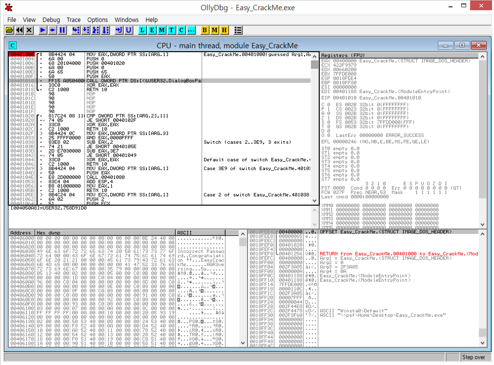
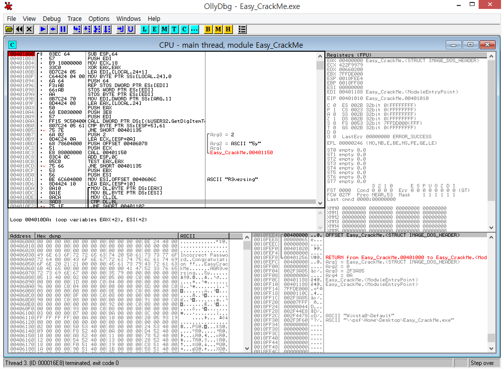

# reversing.kr - Easy Crack(100)

0x401000이 출발점이다.

0x401000부근에는 다이얼로그를 호출하는 함수밖에 없고, 아래쪽에 뭔가 루틴같이 생긴 것이 있다.

찾았다. 직접 비교를해서 분기하는 부분만 분석하면 

0x4010B0 : 2번째 글자 == 'a'

0x4010B7 ~ 0x4010CD : 3+4번째 글자 == '5y'

0x4010D1 ~ 0x4010FC : (5번째글자~) == 'R3versing'

0x40110D ~ 0x40110D : 1번째글자 == 'E'

flag is Ea5yR3versing