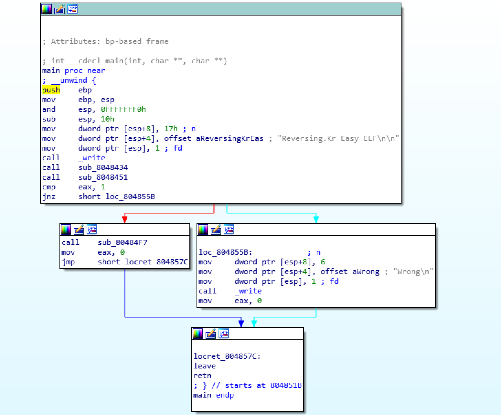
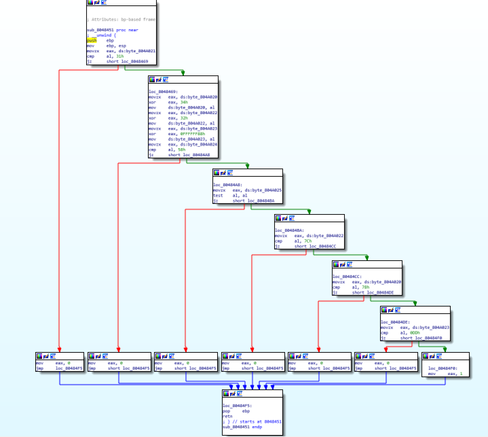

# reversing.kr - Easy ELF(100)

elf 파일이다. 정적분석으로 끝내자.

main 함수이다. sub_8048434로 값을 입력받고 sub_8048451을 실행한 뒤 분기하여 성공 여부를 판가름한다. (sub_80484F7은 Correct!를 출력한다.)

sub_8048451을 분석하면 순서대로

byte_804A021 == 0x31 ('1')

byte_804A024 == 0x58 ('X')

byte_804A025 == null (0x00)

byte_804A022 ^ 0x32 == 0x7C

byte_804A020 ^ 0x34 == 0x78

byte_804A023 ^ 0xFFFFFF88 == 0x0DD 임을 만족하면 eax가 0, 하나라도 불만족 시 eax가 1인 함수임을 알 수 있다.

eax가 1이어야 sub_8048451이 실행되므로 조건을 모두 만족하는 문자열을 찾으면 된다.

flag is L1NUX

