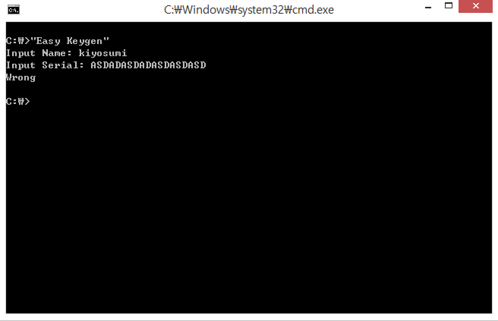
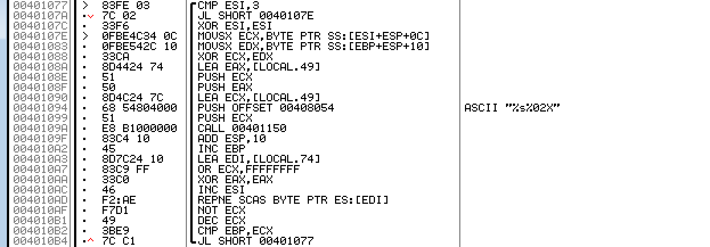
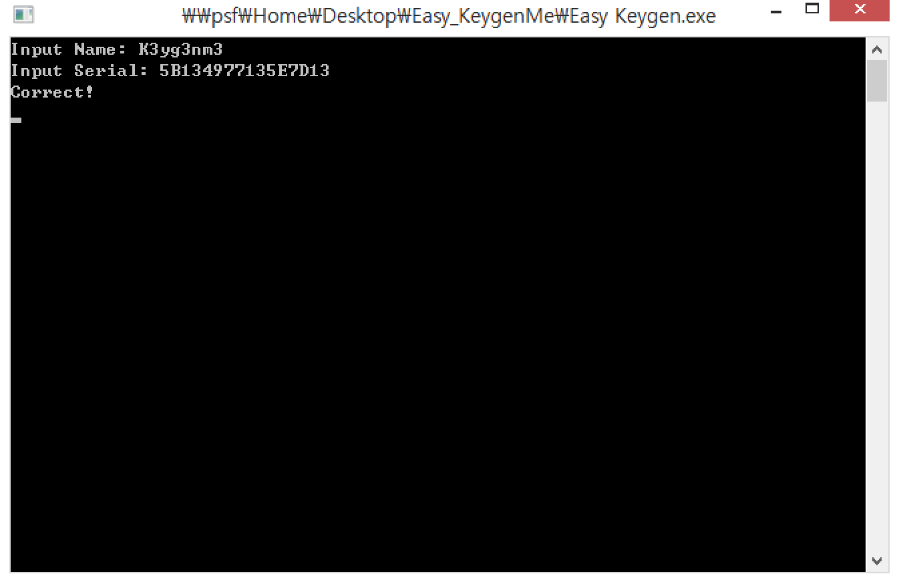

# reversing.kr - Easy Keygen(100)

Q : Find the Name when the Serial is 5B134977135E7D13

이름과 시리얼을 받는 프로그램이다. 이름을 통해 시리얼을 만드는 프로그램인 듯 하다.

출발점은 0x401000이며, 0x401059에서 이름을 입력받은 뒤 

위와 같은 수상한 루틴을 거친다.

직접 분석하면 n번째 문자의 헥스값에 (n%3 + 1) * 0x10을 XOR한 값을 이어붙이는 루틴임을 알 수 있다.

간단한 루틴이므로 역연산은 직접 해주자. 

flag is K3yg3nm3

