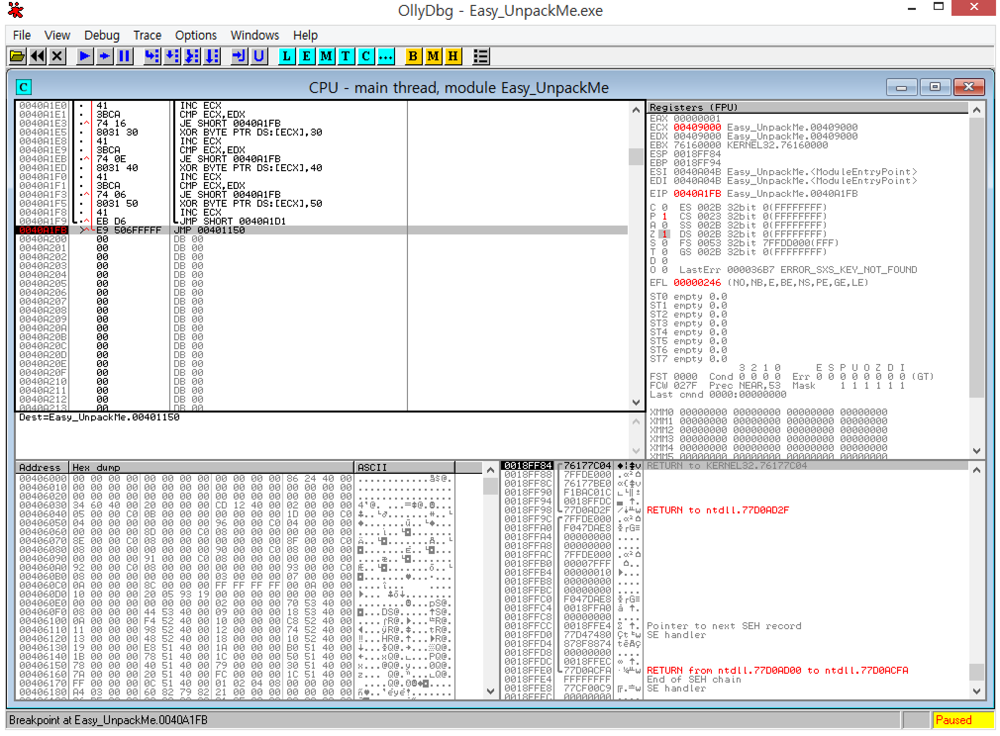
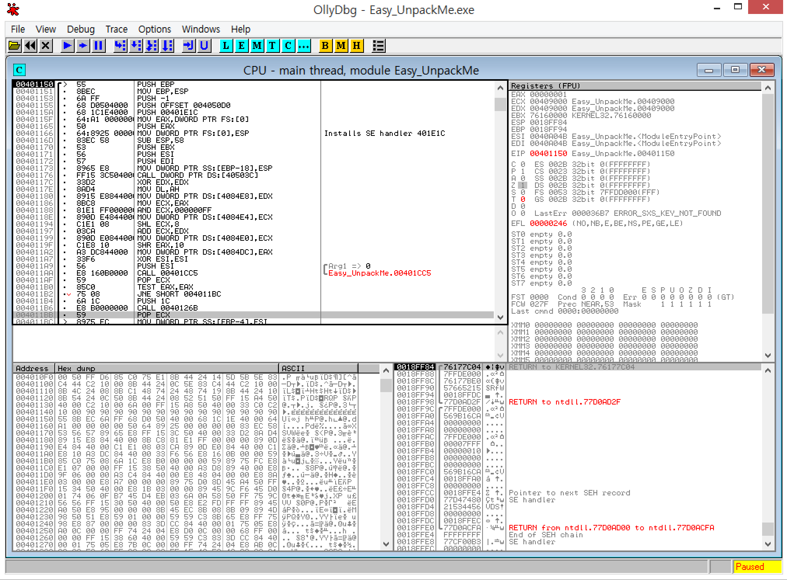

# reversing.kr - Easy Unpack(100)

Q : Find the OEP

odbg로 켜면 상당히 귀찮은 루틴들이 많이 반복되는데, 쭉 반복하다보면

0x401150으로 간다.

아쉽지만 복호화 끝이다.

❖ 처음엔 아랫부분 일부가 난잡하게 되어있어 "어라?" 할 수도 있겠지만 Ctrl + A를 누르면 깔끔하게 정리된다.

flag is 00401150

