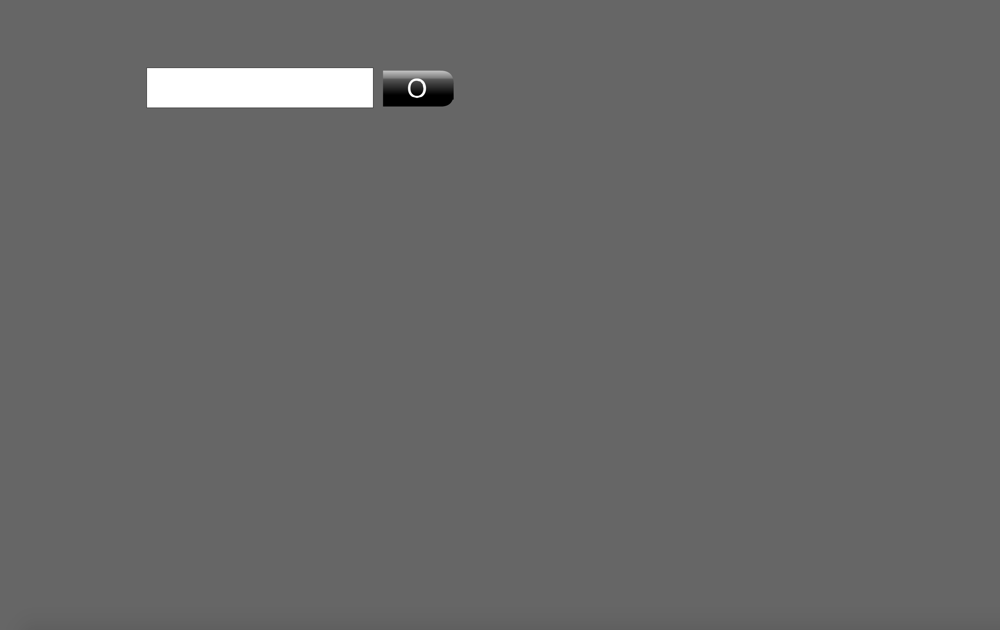
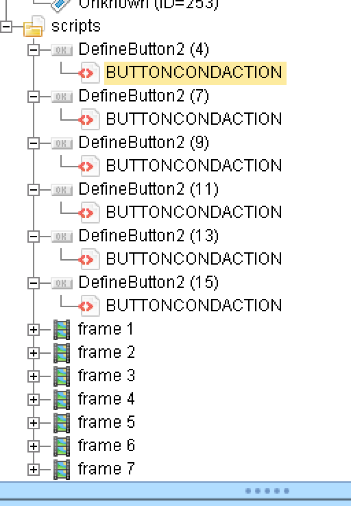
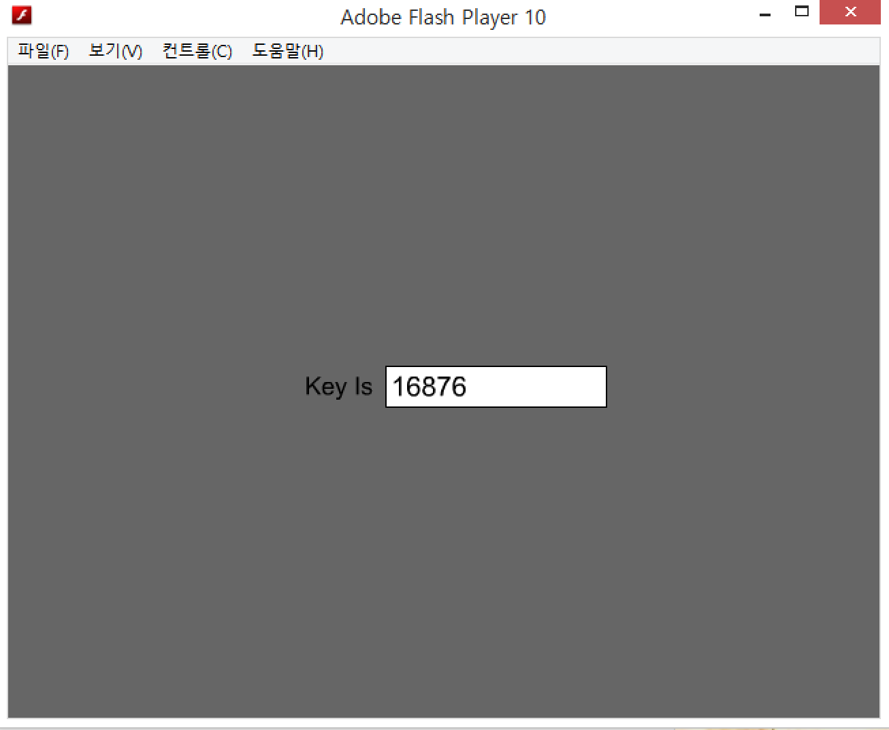

# Reversing.kr - Flash Encrypt(240)

FILE : swf file



무언가 입력받는 프로그램이다. 바로 JPEXS로 뜯어보자.



뭔가 버튼이 많다. 각각의 버튼에 여러가지 스크립트가 있는데, 필요한 부분들만을 잘라오면 다음과 같다.


```c
//// Play 1

				if(§\x01§ == 933)
               {
                  §\x01§ = §\x01§ - 463;
                  if(§��p�\x03§ == 1456)
                  {
                     gotoAndPlay(3);
                  }
                  else
                  {
                     §�>\x07gj§["��p�\x03"] = "��\r޳";
                  }
                  break;
               }

//// Play 2

               else
               {
                  if(§\x01§ == 95)
                  {
                     §\x01§ = §\x01§ + 88;
                     continue;
                  }
                  if(§\x01§ == 183)
                  {
                     §\x01§ = §\x01§ + 687;
                     if(spwd == 8)
                     {
                        spw = spw / spwd;
                        spwd = "";
                        gotoAndPlay(6);
                     }
                     break;
                  }
                 
//// Play 3
                 
         if(§\x01§ == 312)
         {
            §\x01§ = §\x01§ + 452;
            if(§���§ == 25)
            {
               §�\x04�§ = §�\x04�§ * §���§;
               §���§ = "§§constant2";
               gotoAndPlay(4);
            }
            break;
         }
                 
//// Play 4
                 if(§\x01§ == 905)
               {
                  §\x01§ = §\x01§ - 312;
                  if(§c�§ == 44)
                  {
                     §\x0ek�§ = §\x0ek�§ + §c�§;
                     §c�§ = "|W��\x18";
                     gotoAndPlay(2);
                  }
                  break;
               }
                   
//// Play 5
                   if(§\x01§ == 203)
                        {
                           §\x01§ = §\x01§ + 509;
                           if(spwd == 20546)
                           {
                              spw = spw % spwd;
                              spwd = "";
                              gotoAndPlay(7);
                           }
                           break;
                        }
                   
//// Play 6
                   if(§\x01§ == 117)
                  {
                     §\x01§ = §\x01§ - 69;
                     if(§d4�f§ == 88)
                     {
                        §~��3§ = §~��3§ * §d4�f§;
                        §d4�f§ = "\n-\f";
                        gotoAndPlay(5);
                     }
                     break;
                  }
```

순서는 1->3->4->2->6->5->7(key)이다. 등식이 성립하도록 순서대로 입력해주자.


※ 1456 -> 25 -> 44 -> 8 -> 88 ->20546




flag is 16876