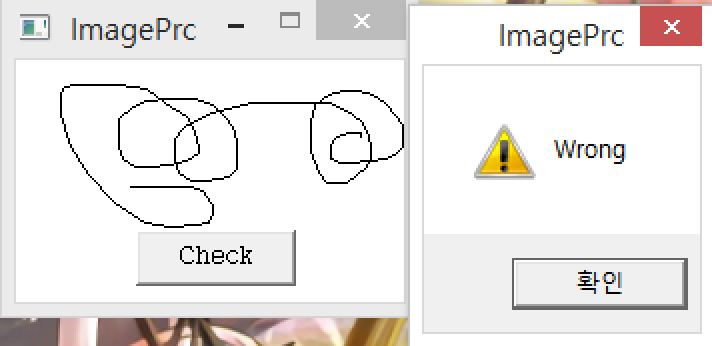
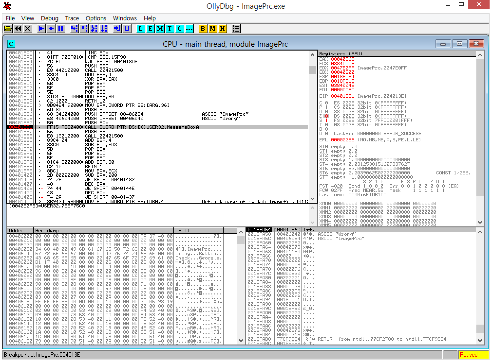
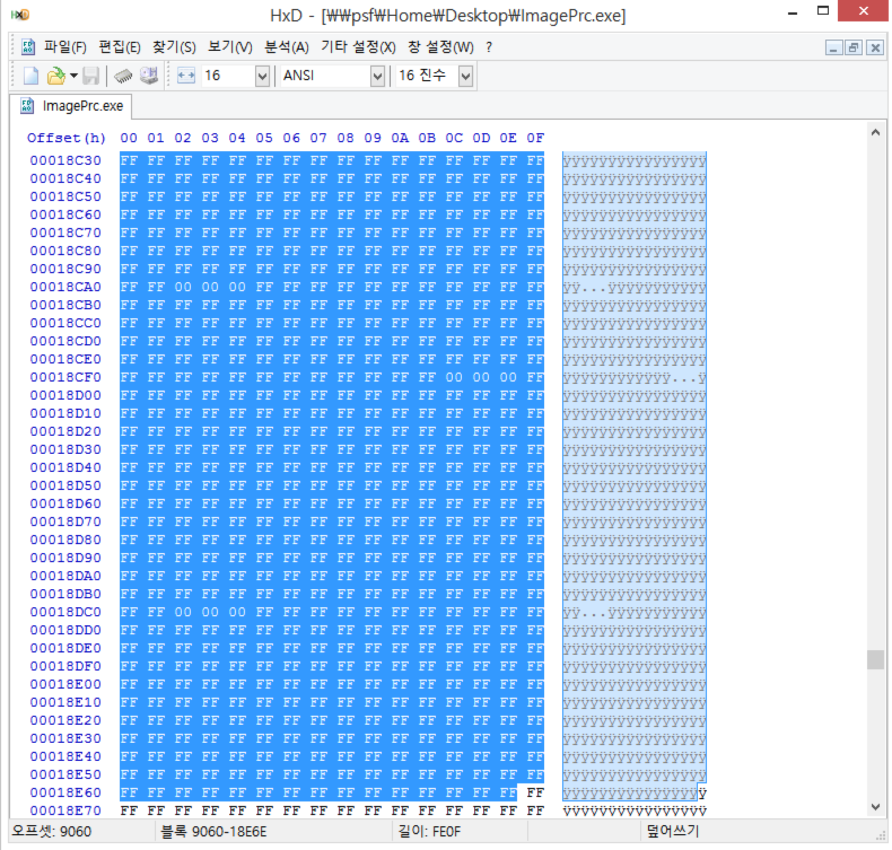
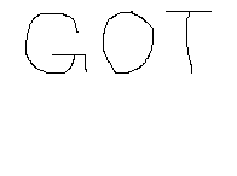

# reversing.kr - ImagePrc(120)

실행해보면 그림판과 같은 화면이 뜬다. 아무거나 그리고 버튼을 누르면

이렇게 뜬다. 그림을 맞춰 그려야 하는 모양인 듯 하다.

체크루틴이 있고, 메세지박스가 뜨므로 MessageBoxA 함수에 BP를 걸고 달리자.

위쪽을 살펴보면 0x4013A3~0x4013B4에 반복루틴이 있다. 한 픽셀씩 따와서 비교를 하는 모양이다. 그렇다면 정답 픽셀값들에 대한 정보가 프로그램 내부에 저장되어 있을 것이다.

0x401089, 0x40108E를 통해 해상도가 200x150임을 알 수 있고 헥스값의 형태상 비트맵 파일일 가능성이 높으므로 헥스값 복붙 뒤에 새 비트맵 파일을 만들어서 헤더를 적당히 만들어주자.

flag is GOT

